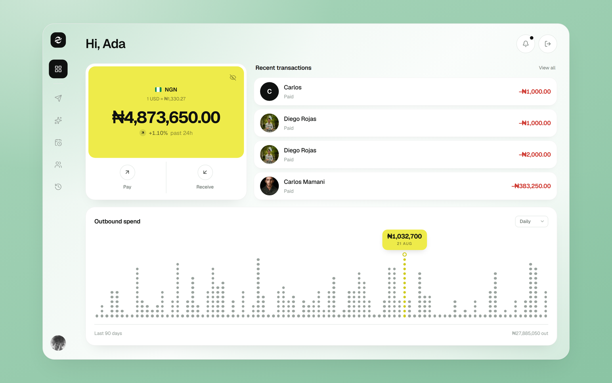
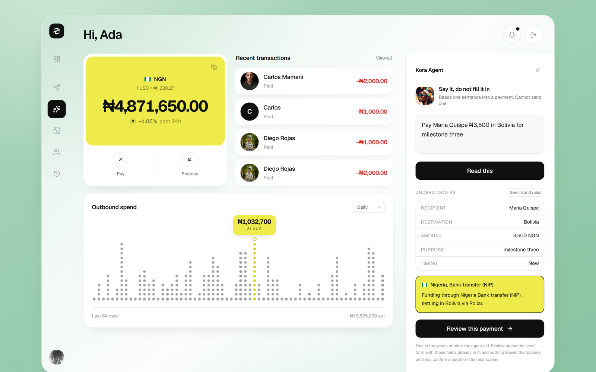
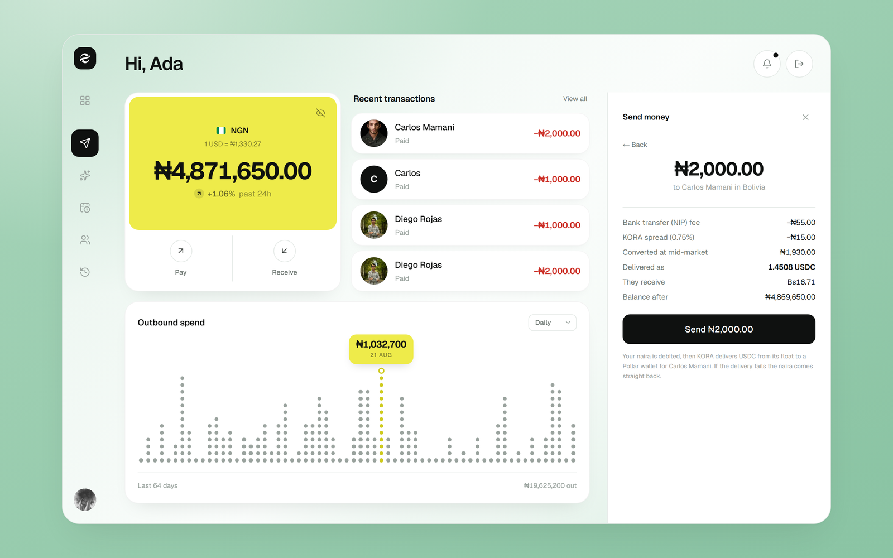
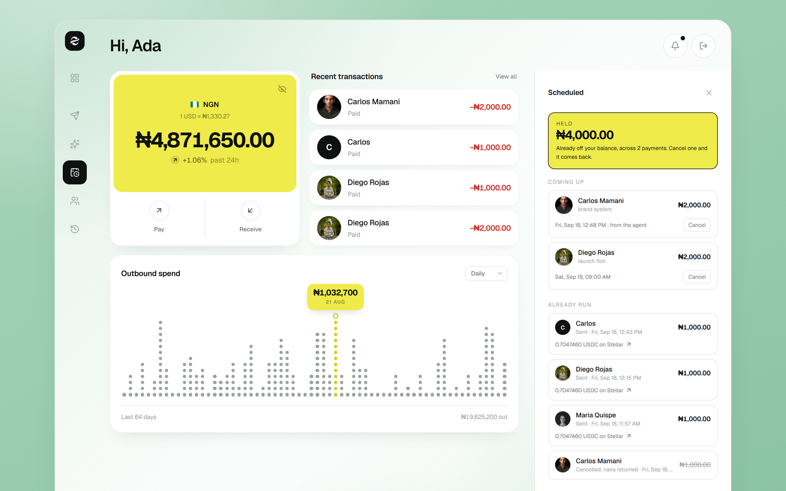

# KORA

**KORA is the African half of a money corridor that Pollar does not have yet. Somebody in
Lagos types one sentence, pays with a Nigerian bank transfer, and the value lands as USDC on
Stellar inside a Pollar wallet belonging to somebody in Bolivia.**

[Open the live app](https://korapay.vercel.app) ·
[The settlement account on Stellar](https://stellar.expert/explorer/testnet/account/GAEHDX7IXJHG2UUCCUES63C7WBLPXJX6IHTA6TGENHDJBSZ65AB7FWQE) ·
[A payment our own scheduler sent while nobody was watching](https://stellar.expert/explorer/testnet/tx/6f56b63399380c819337b0ee9c06f8d026cee4af21b3fef6f5661a3517bc5411)



Built for the **Pollar Hackathon**, against the flagship challenge: build the African leg of
an Africa to Latin America corridor and connect it to Pollar. 170 commits. 107 automated
checks. Four real Stellar transactions a judge can open in a block explorer right now,
including one that a timer on a rented Linux server sent by itself.

---

## The one number that explains this whole project

Pollar ships a list of the payment rails it supports. Here it is, copied out of
`@pollar/core@0.11.3`, not paraphrased:

```
SPEI | PIX | PSE | ACH | BREB | QR
```

Six rails. Mexico, Brazil, Colombia, Bolivia. Every single one of them Latin American.

Now count the African ones.

**Zero.** Africa is not missing a feature in Pollar. Africa is missing from the type system.
There is no word for a Nigerian bank transfer in the vocabulary Pollar's ramps are written
in, so no amount of configuring the dashboard will ever produce one.

That is the whole brief in one number, and it decided the shape of our answer. We did not
build an app that sits beside Pollar and calls it. **We built the corridor provider Pollar
is missing, written to Pollar's own contract, in Pollar's own vocabulary, under Pollar's own
rule.** Our registry adds five rails that did not exist before:

```
NIP | MPESA | MOMO | P2P | AGENT
```

You can watch the smoke suite prove the gap and prove our answer in the same run, with
`npm run smoke`:

```
Registry
  KORA:   7 corridors / 5 countries (2 executable)
  Pollar: 7 corridors / 4 countries
  Pollar rails: SPEI, PIX, PSE, ACH, BREB, QR
  KORA adds:    NIP, MPESA, MOMO, P2P, AGENT
[  ok  ] Pollar has zero African corridors
```

---

## The person this is for

Ada is a designer in Lagos. Carlos is her client in Bolivia. Today, paying him means a bank
that will ask her why, a rate nobody will show her, a fee buried inside that rate, and three
days of not knowing whether it arrived.

She does not want a crypto product. She wants the money to go.

So KORA gives her one box to type a sentence into, one price with every line of it written
out, and a receipt that is a public transaction anybody can check. Everything difficult about
this is behind that, where it belongs.

---

## What we built

A working money account with a real corridor under it. Five things, all live at
[korapay.vercel.app](https://korapay.vercel.app):

**1. An account that holds real naira.** Money comes in through a genuine Nigerian bank
account number, issued per person by Flutterwave, confirmed by a signed webhook, and written
to a ledger. The balance on the screen is the sum of that ledger, never a number we typed.

**2. An agent that reads, and is not allowed to spend.** Type "Pay Maria Quispe ₦3,500 in
Bolivia for milestone three" and it fills in a payment. It cannot send one. The screen even
tells you which parser produced each answer.



**3. A price with nothing hidden in it.** The rail fee and our margin are separate lines. The
conversion happens at the mid-market rate, fetched live, credited to its source. There is no
markup smuggled into the rate, because you can see the rate.



**4. A real hand-off to Pollar.** Pollar's Server API creates a Stellar wallet for the
person being paid. The key lives in Pollar's own KMS, the account is sponsored, and the USDC
trustline is there the moment the wallet exists. Then KORA's treasury sends the USDC. The
transaction hash is on the screen and on the public network.

**5. Payments that happen when you are asleep.** Schedule one for Saturday morning. The
naira leaves your balance now and is held. A timer on a server we rent, not a browser tab,
wakes up every minute and delivers whatever has fallen due.



---

## What we use from Pollar, and how deeply

| Pollar capability | What it does for KORA | Where |
|---|---|---|
| Server API, `POST /v1/users/with-wallet` | Creates the beneficiary's Stellar wallet. This is the hand-off itself | [`src/lib/pollar/server.ts`](src/lib/pollar/server.ts), [`src/lib/payments/settle.ts:147`](src/lib/payments/settle.ts) |
| Treasury sponsorship and trustlines | The person being paid never buys XLM and never opens a trustline. They just have a wallet that can hold dollars | Pollar dashboard, proved by [`/api/pollar/status?deep=1`](src/app/api/pollar/status/route.ts) |
| The corridor data model | Direction, country, currency, rail, asset. Our whole registry is built on Pollar's unit, not our own | [`src/lib/corridor/pollar-shapes.ts`](src/lib/corridor/pollar-shapes.ts) |
| `RampDepositInstructions` | Our adapters return Pollar's payment instruction shape, so one screen renders a Pollar ramp and a Nigerian bank transfer without knowing which it got | [`src/lib/corridor/adapters/shared.ts`](src/lib/corridor/adapters/shared.ts) |
| The rail list, `PollarRail` | We extend it rather than replace it. `KoraRail = PollarRail \| AfricanRail` | [`src/lib/corridor/types.ts:38`](src/lib/corridor/types.ts) |
| `POST /ramps/offramp` | The Bolivian cash-out. We build Pollar's exact request and call it, so its refusal is recorded evidence instead of a claim | [`src/lib/pollar/offramp.ts`](src/lib/pollar/offramp.ts) |
| `PollarProvider`, `@pollar/react` | Mounted at the root of the app, and mounted even when no key is present so the missing piece is visibly the hand-off rather than the whole product | [`src/app/providers.tsx`](src/app/providers.tsx) |

### Why the payment path runs through Pollar's Server API

This is the design decision we would most like a Pollar engineer to look at.

Pollar has two front doors and they fail for completely different reasons. The browser SDK
talks to `sdk.api.pollar.xyz` with the publishable key and is checked against the list of web
addresses you allow in the dashboard. The Server API talks to `server.api.pollar.xyz` with the
secret key and is not origin checked at all.

We only learned that by testing both. It took the project from stuck to shipping, and it
cost a day. Our app now has a screen you can hit that tells you which door is open:

```
GET /api/pollar/status
{"server-api": "pass", "domains": "blocked", "summary": {"backend":"pass","browser":"blocked"}}
```

But the real reason the Server API carries the payment is simpler. **A scheduled payment has
to settle at 08:00 on a Saturday when there is no browser open, no session, and nobody
signed in.** A browser SDK cannot do that by definition. So KORA reserves the money when you
ask, and finishes the job from the server when it is due. Those are two different moments in
the life of a payment and [`settle.ts`](src/lib/payments/settle.ts) exists because of it.

### Two things in Pollar's docs that did not survive contact with the live API

We report these because they cost us hours and would cost the next team the same:

1. **`WALLET_CREATION_FAILED` is documented as a temporary Stellar problem.** It is not. It
   is what you get when the reserve wallet in Treasury has no money in it. Three attempts,
   three identical failures, zero randomness.
2. **Wallet creation returns `walletAddress` and `funded` on the user object**, not the
   nested `wallet.publicKey` that the rest of the reference implies. Our client is typed
   against what the server actually sends.

### Where we drew the line

`x402` appears in the hackathon description. It does not appear in `@pollar/core@0.11.3` or
in the docs. We left it out of our pitch rather than claim it.

Pollar Earn was probed properly, with a script that still runs (`npm run probe:earn`). It
needs a signed-in Pollar user, not just an app key. We recorded the finding and shipped
nothing that pretends otherwise.

---

## The rest of the stack, and what each piece is actually load bearing for

| Technology | Its job here | Remove it and what breaks | Where |
|---|---|---|---|
| **Flutterwave** | Issues a genuine Nigerian bank account number per payment and confirms receipt by signed webhook | The Nigerian leg goes back to a person reading a bank statement | [`src/lib/flutterwave/client.ts`](src/lib/flutterwave/client.ts) |
| **Stellar** (`@stellar/stellar-sdk`) | The treasury signs and sends the actual USDC | There is no proof any money moved | [`src/lib/stellar/treasury.ts`](src/lib/stellar/treasury.ts) |
| **Circle USDC** | The dollar the corridor carries. Issuer checked against Horizon, not copied off a page | The two halves of the corridor have no shared unit | [`src/lib/pollar/config.ts`](src/lib/pollar/config.ts) |
| **Google Gemini** | Reads loose human sentences, relative dates and purpose | Typing "next Friday" stops working. Numbers keep working | [`src/lib/intent/gemini.ts`](src/lib/intent/gemini.ts) |
| **Upstash Redis** | Money that has been reserved survives a restart and is shared between servers | Held payments live in one function's memory, which is the worst place money can be | [`src/lib/store/redis.ts`](src/lib/store/redis.ts) |
| **Next.js 16** | App Router, route handlers, and the `proxy.ts` gate in front of the account | No server rendering, no API, no front door | [`src/proxy.ts`](src/proxy.ts) |
| **Vercel** | Hosting, environment separation, and the production build | Nothing is reachable | `.vercel/` |
| **A rented Linux server** | A systemd timer with a lock, firing the scheduled runner once a minute | Scheduled payments only go out while a browser tab is open | [`scripts/kora-runner.sh`](scripts/kora-runner.sh) |

---

## How one payment actually moves

These are real numbers from a real payment, and every one of them is checkable. This is
`KORA-SCH-4U2RDC`, sent on 18 September 2026.

**1. Reading.** The sentence goes to a plain pattern matcher first. Gemini runs second and
merges under one rule that lives in one function you can read:

```
amount and currency   the pattern matcher wins whenever it found one
everything else       the model wins when it has an answer, patterns fill the rest
```

The model is never allowed to overrule a number a regular expression already read
correctly. Those are the two fields where a confident wrong answer costs somebody money, and
they happen to be exactly the two that patterns are good at. The model earns its place on
the messy parts, like turning "next Friday" into a date:

```
POST /api/intent   {"text": "Send 120,000 naira to Carlos in Bolivia next Friday for the brand system"}

{"amount":120000,"currency":"NGN","recipientName":"Carlos","destinationCountry":"BO",
 "purpose":"brand system","timing":"scheduled","scheduledFor":"2026-09-25T09:00:00Z",
 "source":"gemini",
 "note":"Interpreted \"friday\" as the next one. Scheduled for next Friday, September 25, 2026 at 09:00 local time."}
```

**2. Routing.** The parsed payment is checked against the corridor registry. It cannot name
a corridor that does not exist, and a corridor with no code behind it refuses to produce a
price at all.

**3. Pricing.** ₦2,000 to Bolivia, priced live:

| Line | Amount |
|---|---|
| Bank transfer (NIP) fee | −₦55.00 |
| KORA spread (0.75%) | −₦15.00 |
| Converted at mid-market | ₦1,930.00 |
| Delivered as | **1.4508 USDC** |
| They receive | Bs16.71 |

**4. Reserving.** The naira leaves the balance immediately and is held against the reference.
Cancel it and it comes back, exactly, to the naira. The suite checks that the difference is
zero rather than "about right".

**5. Waiting.** Held at 11:46:35 UTC, due at 11:48:00 UTC. Nothing happens in between.

**6. Settling, with nobody present.** At 11:48 the timer on our server woke up, asked the app
what was due, and the app finished the job: Pollar provisioned the wallet, the treasury
signed the transfer.

```
11:48:13 UTC   delivered 1.4508371 USDC
               hash 6f56b63399380c819337b0ee9c06f8d026cee4af21b3fef6f5661a3517bc5411
```

**7. Proof.** Ask the public Stellar network yourself:

```
GET https://horizon-testnet.stellar.org/transactions/6f56b633...5411
  ledger 4741701 · successful: true · 2026-09-18T11:48:12Z

GET .../operations
  payment · USDC · 1.4508371 · to GAXMTAOXFC...
```

**1.4508371 on the price screen. 1.4508371 in our ledger. 1.4508371 on a public
blockchain.** The quote, the book and the chain agree to seven decimal places, and none of
those three numbers was typed by a human.

**8. The last mile.** Bolivianos into a Bolivian bank account. This is Pollar's leg, it runs
on Stereum on mainnet, and the brief told us not to build it. So we did not. We build the
exact request Pollar documents, send it, record the refusal, and label the result simulated
everywhere it appears. See the honesty table below.

```
🇳🇬 NGN ──▶ NIP bank transfer ──▶ USDC on Stellar ══▶ POLLAR WALLET ══▶ BOB 🇧🇴
   └───────────── KORA's leg, this repo ──────────┘  └── Pollar's leg ──┘
```

---

## The three parts that were genuinely hard

**Honesty that a developer cannot switch off.** Every corridor declares whether it is `live`,
`sandbox` or `planned`. Planned ones do not show a "coming soon" badge. They throw
`CorridorNotExecutable` on every single verb, so there is no code path that can price one,
fund one or settle one, and the smoke suite asserts it. Each one also names its real blocker,
which is almost never code: an MTN partner agreement, a sponsoring bank for PayShap, a Bank
of Uganda licence. Try to quote `GH.GHS.MOMO.onramp` and the program stops you.

**Making two runners impossible instead of defending against two runners.** The obvious way
to fire scheduled payments is a hosted cron. Hosted crons retry, and they overlap, so
eventually two of them ask for the same due payment at the same moment and somebody gets paid
twice. Our store does a read, a check and a write without a lock, so it would not survive
that. The fix is not a cleverer store. The fix is one timer, on one host, wrapped in
`flock -n`, holding a secret that a browser can never hold. The race stops being reachable.
When the secret is set, the app itself notices and the dashboard stops polling, which you can
read back from `GET /api/schedule`:

```
{"durable": true, "runner": "cron"}
```

**Splitting a payment into two moments.** A send used to be one function. Once payments could
be scheduled, it had to become two: reserve (quote, check, debit) and settle (provision,
deliver, price the last mile). For an instant payment they are a millisecond apart and the
split is invisible. For one scheduled for Saturday they are days apart, and the second half
must run with no request, no session, and nobody near a browser. Same code path for both,
which is why the scheduled one is not a different, weaker product.

---

## What is real and what is not

The most important table here. Nothing below is rounded in our favour.

| Step | Status | Detail |
|---|---|---|
| Sentence into a payment | **Real** | Pattern matcher plus Gemini, merged under a fixed rule. Runs in production, verified live |
| Corridor routing and limits | **Real** | Against the live registry. Unroutable requests are refused, not guessed |
| Exchange rate and fee breakdown | **Real** | Fetched live from exchangerate-api.com, credited and timestamped |
| Naira coming in | **Real** | Flutterwave issues the account, a signed webhook confirms receipt, the ledger moves |
| The ledger and held money | **Real** | Redis-backed in production, survives restarts, shared across servers |
| Pollar wallet creation | **Real** | Pollar Server API, sponsored, USDC trustline present at creation |
| The USDC transfer | **Real** | Signed by our treasury, on the public Stellar testnet, four verifiable hashes |
| Scheduled delivery | **Real** | A systemd timer on a rented server, firing every minute, with a lock |
| Naira physically leaving a Nigerian bank | **Simulated** | Flutterwave test mode settles the charge itself. Going live needs a licensed collections partner, which is a commercial agreement rather than code |
| Bolivianos reaching a Bolivian bank | **Simulated** | Pollar's leg, via Stereum, mainnet only. The brief said not to build it |
| Sign in | **Not a security boundary** | Any credentials are accepted and the cookie is unsigned. It is a front door, not a lock, and [the code says so](src/lib/demo-session.ts) in the places somebody might mistake it for one |
| The browser SDK on our deployed URL | **Needs one dashboard setting** | Pollar checks web addresses exactly. Nothing in the shipped payment path depends on it, which is why production works anyway |

On testnet, **no fiat leg is live for anybody**, including Pollar: its own SEP-24 fiat deposit
is marked "coming soon" in its example app. A simulated African cash leg is not us cutting a
corner. It is the ceiling testnet puts on both ends of this corridor.

---

## Test log

We wrote down every test, including the ones that failed and what they caught. This is a
summary. **107 automated checks pass across three suites.** Behind them sit 248 individual
test runs and measurements recorded, one line at a time, in our internal log while we built.

### Suites

| Suite | Command | Checks | Result | Notes |
|---|---|---|---|---|
| Corridor and intent | `npm run smoke` | **34** | All passed | No keys, no browser, no network account needed |
| Account activity | `npm run probe:activity` | **33** | All passed | Proves the ledger reaches both the list and the chart |
| End to end, real money | `npm run e2e` | **40** | All passed | Not in the default run. It spends real testnet USDC out of the float |
| Types | `npm run typecheck` | Whole project | Clean | Recorded clean on 16 separate occasions |
| Production build | `npm run build` | **26 routes + Proxy** | Clean | Recorded clean on 15 separate occasions |

### Verified again while writing this README, 18 September 2026

```
npm run smoke          34/34 passed
npm run probe:activity 33/33 passed
npm run typecheck      clean
npm run build          clean, 26 routes + Proxy, compiled in 1468ms
```

Live production checks, run against [korapay.vercel.app](https://korapay.vercel.app) the
same afternoon:

| Check | Result |
|---|---|
| App reachable | `200` |
| Pollar Server API | `pass`, secret key accepted |
| Held money is durable | `durable: true`, Redis reachable from production |
| Scheduler is a real timer | `runner: "cron"`, the browser has stopped driving payments |
| Gemini parsing a date | `"next Friday"` became `2026-09-25T09:00:00Z`, `source: "gemini"` |
| Scheduled payment delivered | `1.4508371 USDC`, hash `6f56b633…5411` |
| That transaction on Horizon | `successful: true`, ledger `4741701` |

### Sample output

```
[  ok  ] Pollar has zero African corridors
[  ok  ] every non-live corridor explains itself
[  ok  ] breakdown reconciles to the USDC figure  74.5677660 vs 74.567766
[  ok  ] reporting does not fund
[  ok  ] operator confirmation funds it
[  ok  ] M-Pesa emits a scannable
[  ok  ] USSD payload carries the paybill and reference  *334*1*400200*5000*KORA-VMXTGE#
[  ok  ] Nigeria NIP fields use only Pollar's key enum
[  ok  ] Kenya M-Pesa fields use only Pollar's type enum
[  ok  ] both adapters render from the same field vocabulary
[  ok  ] quoting GH.GHS.MOMO.onramp throws CorridorNotExecutable
[  ok  ] below-minimum amount is rejected

All checks passed
```

### Four real transactions on the public Stellar testnet

| What | Amount | Ledger | Hash |
|---|---|---|---|
| First end to end payment, by hand | 14.8804771 USDC | 4736230 | [`2c44ae64…`](https://stellar.expert/explorer/testnet/tx/2c44ae641c27913d7e7fdb19ecdcf8ac6273e6ca1ba67dbe830b1eb767530508) |
| First scheduled payment, by the runner | 0.7047460 USDC | 4741094 | [`66f336a2…`](https://stellar.expert/explorer/testnet/tx/66f336a230374a604c54e8da8c500db099394151c652cc9a93dd21df2157fed2) |
| Same again, driven by the shell script alone | 0.7047460 USDC | 4741312 | [`60275774…`](https://stellar.expert/explorer/testnet/tx/602757749fb7b072007dde4d6ba53cf725226884cf756b4372789860a235939f) |
| Sent by the server timer, nobody watching | 1.4508371 USDC | 4741701 | [`6f56b633…`](https://stellar.expert/explorer/testnet/tx/6f56b63399380c819337b0ee9c06f8d026cee4af21b3fef6f5661a3517bc5411) |

### Tests that actually caught something

Tests only count if they fail sometimes. Ours did:

- **A false comment in our own code.** A note claimed the M-Pesa QR code used `currentColor`
  so it would follow the page theme. It did not, because the QR library paints with `stroke`
  and our replacement only looked for `fill`. The claim was false until the test forced it
  true.
- **The chart was empty on a background tab.** It waited for a `ResizeObserver` that never
  fires when the page is not drawing. It now measures first and observes second.
- **A copy button that looked finished and did nothing.** The preview environment refuses
  clipboard writes. The first version caught the refusal and stayed silent, so the button was
  dead with no way to tell. It now falls back, and when both routes fail it says so. We
  verified it by sabotaging both routes and watching the refusal appear.
- **The same error was a pass on one machine and a failure on another.** `curl` 8.5.0 on
  Ubuntu returned exit code 22 for a 404. The `curl` in Git Bash returned 0 for the identical
  response. Our runner script branched on that. It now judges the HTTP status and treats
  curl's exit code as meaning only "the request never completed".
- **Eight kilobytes of HTML a minute, into a system log.** A stale deployment served its own
  404 page, and the runner printed all of it, once a minute, forever. An HTML body is now
  described rather than reproduced, and anything else is cut at 400 characters.
- **Windows line endings killed the script on the server.** `/usr/bin/env: 'bash\r': No such
  file or directory`, a message that names bash and sends you to look at bash. `.gitattributes`
  was already correct and did not help, because the file was copied from the working tree
  rather than from Git.
- **Portraits were 17 MB on first paint.** Seven images served raw. Through the image
  optimiser at the sizes actually drawn, the same seven come down to 10,527 bytes of AVIF.
- **Contrast on the sign-in panel was failing and we were measuring it wrong.** Sampling
  whole frames said one thing. Sampling 84,096 pixels through the real blur radius said the
  text was at 4.10 against a floor of 4.5. We changed the tint until it passed at 5.08 and
  re-measured, rather than adjusting until it looked fine.

---

## Run it yourself

Node 20 or newer. We built on 22.18.

```bash
git clone https://github.com/MikeMoulder/kora.git && cd kora
npm install
cp .env.example .env.local
npm run setup:settlement
npm run dev
```

`setup:settlement` creates and funds a Stellar testnet account for you and opens its USDC
trustline. Then add one key to `.env.local`, from
[dashboard.pollar.xyz](https://dashboard.pollar.xyz) under Build, API Keys, Generate,
publishable, testnet:

```
NEXT_PUBLIC_POLLAR_PUBLISHABLE_KEY=pub_testnet_…
```

The app opens on the sign-in screen at `/`. Any credentials work, the fields arrive filled
in, and the account lives at `/dashboard`. Every key is documented in
[`.env.example`](.env.example), including which ones are optional and what breaks without
them.

### Four Pollar dashboard settings, and how each one fails if you skip it

| Dashboard | Setting | Skip it and |
|---|---|---|
| Build, **Domains** | Add `http://localhost:3000` | Every browser SDK call returns 403 `ORIGIN_NOT_ALLOWED`, including the very first one |
| Treasury, **Account Funding** | Put money in the reserve wallet | Wallet creation returns 502 every time, and the docs will tell you it was temporary |
| Treasury, **Sponsorship** | Turn it on | The person being paid has to buy XLM to receive dollars, which defeats the point |
| Treasury, **Tokens and Trustlines** | Add USDC | The transfer fails with `op_no_trust` |

Domains has no wildcards and matches character for character. We tested it:
`http://localhost:3000` passes, `https://localhost:3000` and `http://127.0.0.1:3000` both
fail. Add every deployment address separately.

Check all four at once, any time:

```bash
curl http://localhost:3000/api/pollar/status?deep=1
```

> Testnet keys are capped at 1,000 requests a day, and the SDK signs a proof per
> authenticated request. Worth knowing before you leave a polling loop running overnight.

### Verify the African leg without clicking anything

```bash
npm run smoke
```

Runs the whole thing headless: parse, route, price, fund, report, settle, plus every negative
case. No browser, no keys, no network account. 34 checks in a few seconds.

---

## Repo layout

```
src/lib/corridor/
  pollar-shapes.ts       Pollar's ramp types and rail list, mirrored and credited
  types.ts               KoraCorridor, KoraRailAdapter, readiness
  registry.ts            Our registry, beside Pollar's table, for comparison
  engine.ts              Rail-agnostic orchestration
  rates.ts               Live exchange rates, credited, with a pinned fallback
  adapters/
    nigeria-nip.ts       Bank transfer, collections through Flutterwave
    kenya-mpesa.ts       M-Pesa STK push, with a scannable USSD code
    planned.ts           Five corridors that refuse to run, each naming its blocker

src/lib/intent/          rules.ts then gemini.ts then resolve.ts
src/lib/payments/        settle.ts, the half that runs with nobody present
src/lib/schedule/        store, runner, and the shared-secret check
src/lib/pollar/          config.ts, server.ts (Server API), offramp.ts
src/lib/stellar/         treasury.ts, the signer
src/lib/account/         ledger.ts, activity.ts
src/lib/store/redis.ts   One adapter, both stores, memory by default

src/app/api/             22 route handlers
src/app/dashboard/       The whole product
src/proxy.ts             The gate in front of the account
scripts/kora-runner.sh   The timer, with its own install instructions
```

Adding a country is adding an adapter. There is no `if (country === …)` anywhere in the
engine or the interface.

---

## What would make each corridor live

Almost none of it is code:

| Corridor | What it needs |
|---|---|
| Nigeria, bank transfer | A licensed collections partner on live keys. The code path already runs on Flutterwave test keys |
| Kenya, M-Pesa | An approved Safaricom shortcode and a reviewed Daraja callback address |
| Ghana and Uganda, Mobile Money | A local entity and a signed MTN partner agreement |
| South Africa, PayShap | A sponsoring bank, plus exchange control clearance on the way out |
| Nigeria, P2P | An escrow contract and counterparty liquidity. Deliberately not simulated, because a fake match would hide the settlement risk that is the entire difficulty of this rail |
| Bolivia payout | Pollar on mainnet, through Stereum, with the beneficiary signed in. It is their leg and it should stay theirs |

---

## Built, next, vision

**Built.** Everything in the "what is real" table above. One country funding live, one more
in sandbox, five declared and refusing to run, a real ledger, real scheduling, a real timer
and four transactions on a public network.

**Next, in order.** Kenya M-Pesa on a real Safaricom shortcode. A Lua script on the Redis
transition so the store is safe even with two runners. Receipts the person being paid can
open without an account. A second funding country.

**Vision, not built.** A corridor is one adapter. The registry, the engine, the pricing and
the interface do not know or care which country they are serving. Fill that registry in and
the same product moves money from any African rail into any Pollar market, which makes this
less a remittance app and more the missing half of somebody else's map.

---

## Design notes

The interface carries the argument. Colour is used for one job only: **yellow is money that
is yours, black is an action that commits, and anything simulated is labelled where it
appears.** The spend chart is drawn as a grid of dots that stay perfectly round at any width,
measured rather than assumed, at 1069px, 709px and 309px. Portraits fall back to a monogram
with no layout shift. Motion is five tokens in one stylesheet, so nothing can drift, and all
of it turns off for anybody who has asked their system to stop animations.

Somebody who never reads this file should still be able to point at the screen and say which
half of the corridor we are claiming.
